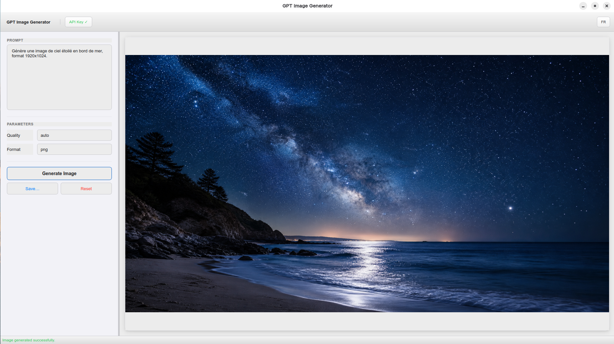

# GPT Image Generator

A cross-platform image generation app powered by the OpenAI API (`gpt-image-2`), built with PyQt6 and designed to run on **Windows, macOS and Linux**.


---

## Features

- **Image generation** from a text prompt using `gpt-image-2`
- **Adjustable parameters**: size, quality, format (PNG / JPEG / WebP), background (transparent / opaque)
- **Save** the generated image in the chosen format
- **API key** stored locally (`~/.config/gpt-image-gen/config.json`), never shared
- **Bilingual interface** — English by default, French available via the toolbar toggle
- **macOS-inspired design**: clean light theme modelled after native Apple applications

---

## Screenshot



---

## Installation

### Windows

Download the latest `.exe` from the [Releases](../../releases) page or the [Actions](../../actions) tab → latest successful build → **Artifacts**.

No installation required — just double-click `GPT-Image-Generator.exe`.

### Linux / macOS

**Requirements**: Python 3.11+

```bash
git clone https://github.com/dorianbannier/gpt-image-gen-qt.git
cd gpt-image-gen-qt
./run.sh
```

`run.sh` automatically creates a virtual environment and installs dependencies on first run.

### Manual dependency install

```bash
pip install PyQt6 openai
python app.py
```

---

## Configuration

On first launch, click **API Key…** in the toolbar and enter your OpenAI key.  
The key is saved locally and never transmitted anywhere.

You can get a key at [platform.openai.com/api-keys](https://platform.openai.com/api-keys).

---

## Generation Parameters

| Parameter | Options | Description |
|-----------|---------|-------------|
| **Quality** | auto, low, medium, high | Speed / quality trade-off |
| **Format** | PNG, JPEG, WebP | Output file format |

---

## Windows Build (developers)

The GitHub Actions workflow automatically generates a `.exe` on every push to `main`.

To trigger it manually: **Actions → Build Windows .exe → Run workflow**

The build uses [PyInstaller](https://pyinstaller.org/) in single-file mode (`--onefile`).

---

## Tech Stack

- [PyQt6](https://pypi.org/project/PyQt6/) — cross-platform GUI framework
- [openai](https://pypi.org/project/openai/) — official OpenAI Python client
- [PyInstaller](https://pyinstaller.org/) — Windows packaging
- [GitHub Actions](https://github.com/features/actions) — CI/CD

---

## License

MIT — free to use, modify and distribute.
